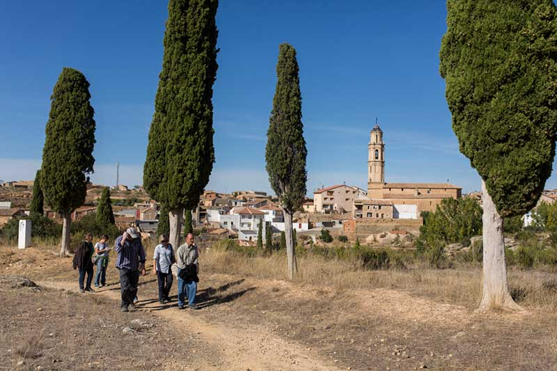

# Mi pueblo, Torrecilla de Alcañiz

## Sobre mi pueblo

Mi pueblo es un municipio tranquilo situado en la provincia de Teruel. Tiene al rededor de 450 habitantes los cuales se duplican practicamente en verano. Actualmente ninguno de mis amigos reside ahí por que no esta cerca de ningun sitio universitario, le guardo cariño porque toda mi familia vive alli pero no tengo pensado residir ahi en un futuro.

## Datos de interes

- Es un pueblo pequeño.
- Mucha libertad.
- No tiene gran cantidad de lugares de interes.

## Mis fechas favoritas

1. **Verano**: Es cuando mas amigos míos hay y cuando quedamos mas.
2. **Navidad**: Veo a toda mi familia y es un buen lugar para descansar.
3. **Quintos**: Es la mejor fiesta y hay mucho ambiente.
